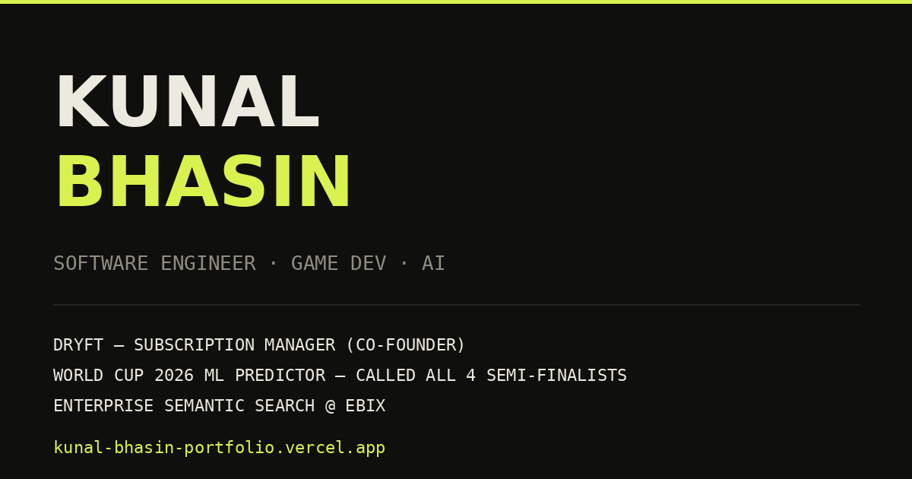

# Personal Portfolio

**Live: [kunal-bhasin-portfolio.vercel.app](https://kunal-bhasin-portfolio.vercel.app)**

My portfolio site — designed and built from scratch with React + Vite. No template, no UI library, hand-written CSS.



## Design

Dark editorial style: oversized condensed type (Archivo variable font — project titles animate along the width axis on hover), serif-italic accents (Instrument Serif), monospace labels (JetBrains Mono), chartreuse accent on warm black, film-grain overlay.

Interactions: staged hero reveal, scroll progress bar, hero parallax, rolling nav links, expandable project rows with screenshot strips and a fullscreen lightbox, embedded product demo video, live clock. Respects `prefers-reduced-motion`.

## Stack

- React 18 + Vite — single-page, no router needed
- Hand-written CSS (one file, custom properties for theming)
- All content lives in [`src/data.js`](src/data.js) — one file to update projects, bio, and links

## Run locally

```bash
npm install
npm run dev
```

## Deploy

`npm run build` → deploy `dist/` anywhere. Currently on Vercel; `vite.config.js` uses `base: './'` so it also works on GitHub Pages or `file://`.

---

Built by [Kunal Bhasin](https://github.com/kunalbhasin135) · [LinkedIn](https://www.linkedin.com/in/kunal-bhasin-4122a62b9/)
